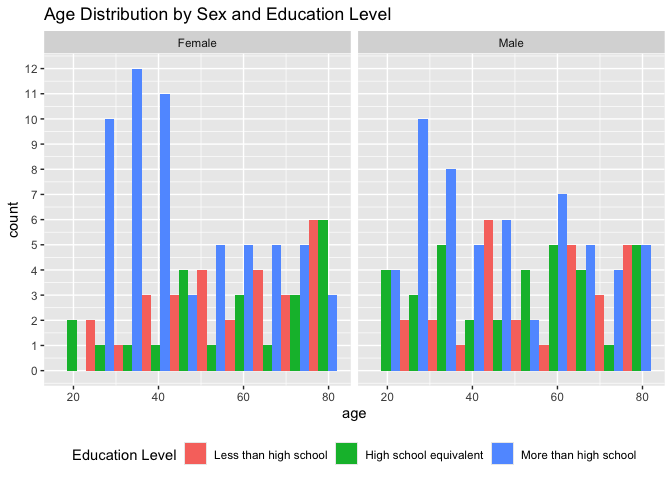
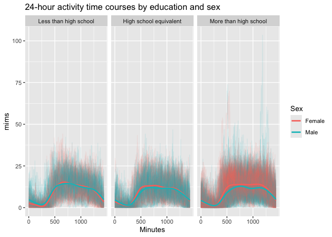
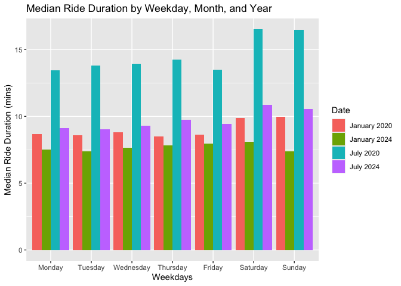

Homework 3
================
Maya Krishnamoorthy
2024-10-06

## Problem 2

*Start by organizing the datasets - load, clean, merge, and organize
into a final `merged_df` dataset.*

``` r
# Import and clean nhanes_accel.csv
accel_df = 
  read_csv("data/nhanes_accel.csv") |> 
  janitor::clean_names() |> 
  pivot_longer(
    min1:min1440,
    names_to = "minute_interval",
    names_prefix = "min",
    values_to = "mims"
  ) |> # Pivot these columns 
  mutate(
    minute_interval = as.numeric(minute_interval)
  )

covar_df = 
  read_csv("data/nhanes_covar.csv", skip = 4) |> # skip first 4 rows
  janitor::clean_names() |> 
  drop_na(sex, age, bmi, education) |> # drop N/A rows from demographic data
  filter(!(age < 21)) |> # filter out people younger than 21
  mutate( # encode variable with reasonable names
    sex = case_match(
      sex,
      1 ~ "Male",
      2 ~ "Female"
    ),
    education = case_match(
      education, 
      1 ~ "Less than high school",
      2 ~ "High school equivalent",
      3 ~ "More than high school"
    ),
    education = factor( # create factor variable
      education,
      levels = c("Less than high school", "High school equivalent", "More than high school")
    )
  )

merged_df = left_join( # merge datasets using a left join so it only includes the data specified from the covar_df
  covar_df, 
  accel_df, 
  by = "seqn"
)
```

*Produce a reader-friendly table for the number of men and women in each
education category.*

``` r
# Create reader-friendly table for the number of men and women in each educ category
merged_df |> 
  distinct(seqn, .keep_all = TRUE) |> # keep all columns but identify unique seq numbers
  group_by(education, sex) |> # group by education and sex 
  summarize(count = n()) |> # get male/female counts
  pivot_wider( # make more reader friendly (male/female)
    names_from = sex,
    values_from = count
  ) |> 
  knitr::kable()
```

    ## `summarise()` has grouped output by 'education'. You can override using the
    ## `.groups` argument.

| education              | Female | Male |
|:-----------------------|-------:|-----:|
| Less than high school  |     28 |   27 |
| High school equivalent |     23 |   35 |
| More than high school  |     59 |   56 |

Thee are about the same number of female and male participants in each
education category except there are far more males in the high school
equivalent group.

*Create a visualization of the age distributions for men and women in
each education category.*

``` r
merged_df |> 
  distinct(seqn, .keep_all = TRUE) |> # keep all columns but identify unique seq numbers
  ggplot(aes(x = age, fill = sex)) +
  geom_histogram(position = "dodge", bins = 10) +
  facet_grid(. ~ education) + 
  theme(legend.position = "bottom") +
  labs(
    title = "Age Distribution by Sex and Education Level",
    fill = "Sex"
  ) +
  scale_y_continuous(breaks = scales::pretty_breaks(n = 10))
```

<!-- -->

There is a concentration of female participants in their 40s and 50s
belonging to the more than high school category, while fewer women in
the same age group have lower education levels. For males, there is a
more even distribution across all ages, but there is a higher
concentration of individuals in their 30s and 40s with more than a high
school education. Overall, both men and women with higher education
levels are distributed more evenly across various age groups, while
those with less education are less represented, particularly at younger
ages.

*Using your tidied dataset, aggregate across minutes to create a total
activity variable for each participant.*

``` r
merged_df |> 
  group_by(seqn, sex, age, education) |> 
  summarize(
    total_mims = sum(mims, na.rm = TRUE)
  ) |> 
  distinct(seqn, .keep_all = TRUE) |> 
  ggplot(aes(x = age, y = total_mims, color = sex)) +
  geom_point() +
  geom_smooth(method = "loess") +
  facet_grid(. ~ education) +
  theme(legend.position = "bottom") +
  labs(
    title = "Total Activity over the Day",
    color = "Sex",
    x = "Age",
    y = "Total Activity (mins)"
  )
```

    ## `summarise()` has grouped output by 'seqn', 'sex', 'age'. You can override
    ## using the `.groups` argument.
    ## `geom_smooth()` using formula = 'y ~ x'

<!-- -->

Females tend to have a higher total activity level than males in all
panels. Overall, in all education categories, there is a general decline
in total activity as age increases, especially noticeable after the age
of 60. This trend is consistent for both males and females, with some
fluctuations before age 60 depending on the education level. Individuals
with higher education tend to show a more gradual decline in activity
compared to those with less education.

``` r
merged_df |> 
  ggplot(aes(x = minute_interval, y = mims, group = seqn, color = sex)) +
  geom_line(alpha = 0.1) + 
  geom_smooth(aes(group = sex), se = FALSE) +
  facet_grid(. ~ education) +
  labs(
    title = "24-hour activity time courses by education and sex",
    x = "Minutes",
    Y = "Activity",
    color = "Sex"
  ) +
  scale_x_continuous(
    breaks = c(0, 500, 1000),
    limits = c(0, 1440),
    labels = c("0", "500", "1000")
  )
```

    ## `geom_smooth()` using method = 'gam' and formula = 'y ~ s(x, bs = "cs")'

<!-- -->

This graph depicts 24-hour activity time courses by education level and
sex. It is divided into three panels representing different education
levels: Less than high school, High school equivalent, and More than
high school. The y-axis shows activity levels in terms of “mims” (a
measurement of physical activity intensity), while the x-axis spans a
24-hour period in minutes (0-1440 minutes).

There is a low activity period early in the day, which is likely when
individuals are asleep, followed by an increase later in the morning and
through the day as expected. Males with more than high school education
tend to participate in less intense physical activity throughout the day
compared to females with more than high school levels of education.

#### Problem 3

*Import, clean, and tidy these data, and describe the resulting
dataset.*

``` r
# Import each dataset, remove duplicates, and add date columns (month and year).

jan_2020 =
  read_csv("data/citibike/Jan 2020 Citi.csv") |> 
  janitor::clean_names() |> 
  mutate(
    month = "January",
    year = 2020
  ) |> 
  distinct(ride_id, .keep_all = TRUE)

jan_2024 =
  read_csv("data/citibike/Jan 2024 Citi.csv") |> 
  janitor::clean_names() |> 
  mutate(
    month = "January",
    year = 2024
  ) |> 
  distinct(ride_id, .keep_all = TRUE)

jul_2020 =
  read_csv("data/citibike/July 2020 Citi.csv") |> 
  janitor::clean_names() |> 
  mutate(
    month = "July",
    year = 2020
  ) |> 
  distinct(ride_id, .keep_all = TRUE)

jul_2024 =
  read_csv("data/citibike/July 2024 Citi.csv") |> 
  janitor::clean_names() |> 
  mutate(
    month = "July",
    year = 2024
  ) |> 
  distinct(ride_id, .keep_all = TRUE)

# Bind the rows together.

citibike_tidy_df = 
  bind_rows(jan_2020, jan_2024, jul_2020, jul_2024) |> 
  mutate(
    rideable_type = case_match( # remove suffix "_bike"
      rideable_type,
      "classic_bike" ~ "classic",
      "electric_bike" ~ "electric"
    ),
    rideable_type = factor( # turn ride type into a factor variable
      rideable_type,
      levels = c("classic", "electric")
    ),
    member_casual = factor( # turn member_casual into a factor variable
      member_casual,
      levels = c("member", "casual")
    ),
    weekdays = factor(
      weekdays,
      levels = c("Monday", "Tuesday", "Wednesday", "Thursday", "Friday", "Saturday", "Sunday")
    )
  ) |> 
  arrange(year, month) # sort by date

# Check if there are any NA values in the ride_id column
any(is.na(citibike_tidy_df$ride_id))
```

    ## [1] FALSE

``` r
# Get number of rows and columns in dataframe.
nrows = nrow(citibike_tidy_df)
ncols = ncol(citibike_tidy_df)
```

Each dataset was first cleaned separately by using the janitor package,
removing duplicate ride_ids, and adding month/year columns. Then, the
four datasets (from January and July of 2020 and 2024) were merged using
bind_rows(). I then converted `rideable_type` and `member_casual` into
factor variables, and removed the suffix “\_bike” from the
`rideable_type` values. The resulting dataset has 99485 rows and 9
columns. The columns are as follows: \* `ride_id` \* `rideable_type`:
Electric or Classic \* `weekdays` \* `start_station_name` \*
`end_station_name` \* `member_casual`: Member or Casual \* `month` \*
`year`

*Produce a reader-friendly table showing the total number of rides in
each combination of year and month separating casual riders and Citi
Bike members.*

``` r
citibike_tidy_df |> 
group_by(member_casual, year, month) |> # group by member_casual and month/year
  summarize(count = n()) |> # get counts organized by groups (month, year, member_casual)
  pivot_wider( # make more reader friendly (member/casual)
    names_from = member_casual,
    values_from = count
  ) |> 
  knitr::kable()
```

| year | month   | member | casual |
|-----:|:--------|-------:|-------:|
| 2020 | January |  11436 |    984 |
| 2020 | July    |  15411 |   5637 |
| 2024 | January |  16753 |   2108 |
| 2024 | July    |  36262 |  10894 |

As seen in the table, there are generally more members than casual
riders. There is a substantial increase in riders for both caetgories in
the summer months compared to winter. The increase is most notable for
members in 2024 between January and July. We can also note the decrease
for casual members between July 2020 and January 2024, whereas there was
a slight increase in members, which may indicate that Citibke has a good
retention of members, but not for casual riders.

*Make a table showing the 5 most popular starting stations for July
2024; include the number of rides originating from these stations.*

``` r
citibike_tidy_df |> 
  group_by(start_station_name) |> # group by starting station
  filter(
    month == "July",
    year == 2024
  ) |> 
  summarize(count = n()) |> # count by start station
  arrange(desc(count)) |> # organize by most popular
  head(5) |> # print the first 5
  knitr::kable()
```

| start_station_name       | count |
|:-------------------------|------:|
| Pier 61 at Chelsea Piers |   163 |
| University Pl & E 14 St  |   155 |
| W 21 St & 6 Ave          |   152 |
| West St & Chambers St    |   150 |
| W 31 St & 7 Ave          |   146 |

*Make a plot to investigate the effects of day of the week, month, and
year on median ride duration.*

``` r
citibike_tidy_df |>
  mutate(
    date = paste(month, year, sep = " ")
  ) |> 
  group_by(date, weekdays) |> 
  summarize(median_duration = median(duration, na.rm = TRUE)) |> 
  ggplot(aes(x = weekdays, y = median_duration, fill = date)) +
  geom_bar(stat = "identity", position = "dodge") +
  labs(
    x = "Weekdays",
    y = "Median Ride Duration (mins)",
    fill = "Date",
    title = "Median Ride Duration by Weekday, Month, and Year"
  )
```

    ## `summarise()` has grouped output by 'date'. You can override using the
    ## `.groups` argument.

<!-- -->
