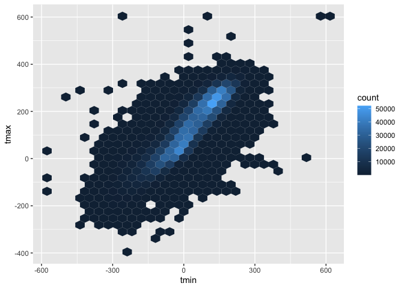
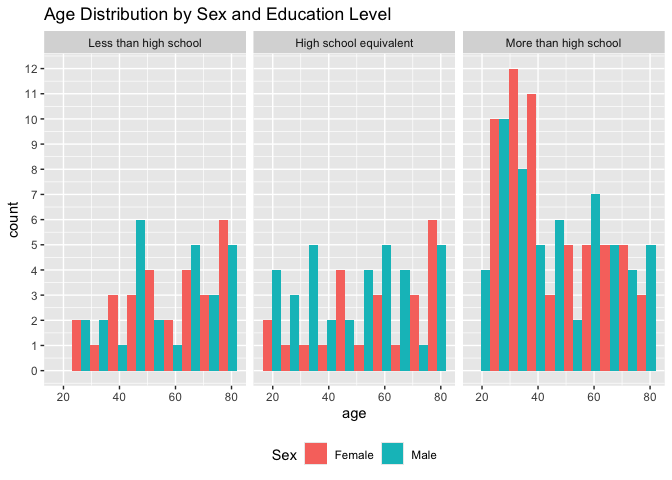
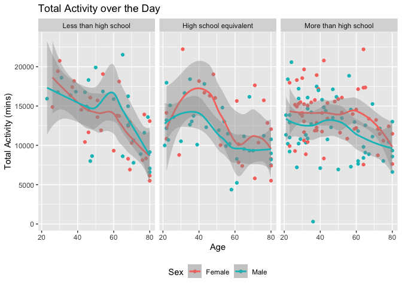
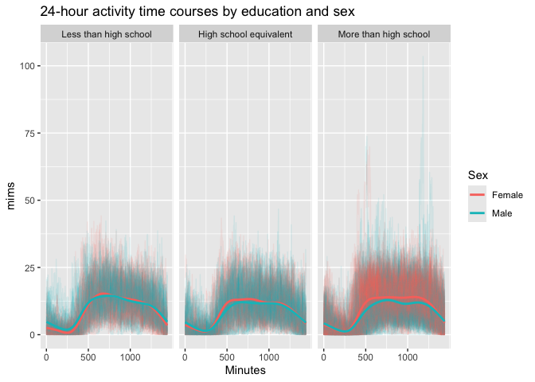
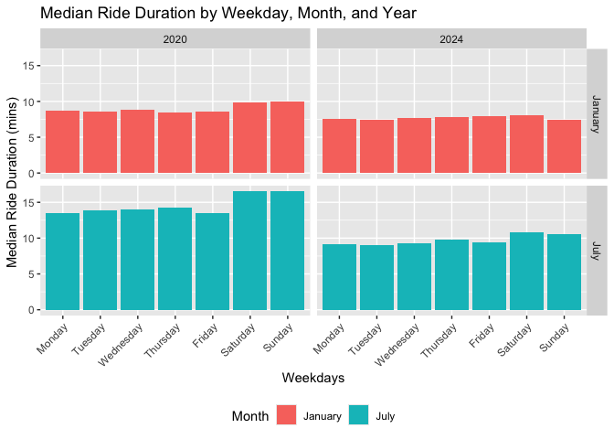
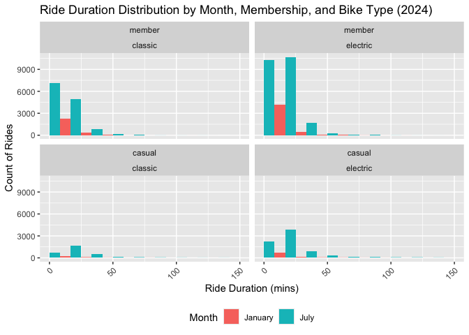

Homework 3
================
Maya Krishnamoorthy
2024-10-06

## Problem 1

``` r
library(p8105.datasets)
data("ny_noaa")
```

This dataset contains 2595176 rows and 7 columns. Variables include
weather station id, date of observation, (tenths of mm), snowfall (mm),
snow depth (mm), and min and max temperature (tenths of degrees C).

Below we clean the data, creating separate variables for year, month,
and day and converting `tmax` and `tmin` to numeric. We find that 0 is
the most commonly observed value for snowfall. This is because most days
of the year, it does not snow at all in NY. The second most commonly
observed value is `NA`, indicating missingness. Other common values are
13, 25, and 51, suggesting that snowfall is originally recorded in
fractions of an inch and converted to mm.

``` r
ny_noaa %>% 
  count(snow) %>%
  arrange(desc(n))
```

    ## # A tibble: 282 × 2
    ##     snow       n
    ##    <int>   <int>
    ##  1     0 2008508
    ##  2    NA  381221
    ##  3    25   31022
    ##  4    13   23095
    ##  5    51   18274
    ##  6    76   10173
    ##  7     8    9962
    ##  8     5    9748
    ##  9    38    9197
    ## 10     3    8790
    ## # ℹ 272 more rows

``` r
ny_noaa = 
  ny_noaa %>% 
  separate(date, into = c("year", "month", "day"), convert = TRUE) %>% 
  mutate(
    tmax = as.numeric(tmax),
    tmin = as.numeric(tmin))
```

Below is a two-panel plot showing the average max temperature in January
and in July in each station across years. As expected, the mean
temperature in January is much lower than the mean temperature in July
for all stations and across all years. All stations appear to follow
similar trends of temperature peaks and valleys within a month across
the years, i.e. when one station has a high monthly mean temperature for
a given year, most other stations also have a high monthly mean
temperature for that year. We do see one uncharacteristically cold
station in July of 1987 or 1988, as well as a few other less drastic
outliers.

``` r
ny_noaa %>% 
  group_by(id, year, month) %>% 
  filter(month %in% c(1, 7)) %>% 
  summarize(mean_tmax = mean(tmax, na.rm = TRUE, color = id)) %>% 
  ggplot(aes(x = year, y = mean_tmax, group = id)) + geom_point() + geom_path() +
  facet_grid(~month) +
  labs(title = "Mean monthly temperature for each station across years for January and July")
```

    ## `summarise()` has grouped output by 'id', 'year'. You can override using the
    ## `.groups` argument.

    ## Warning: Removed 5970 rows containing missing values or values outside the scale range
    ## (`geom_point()`).

    ## Warning: Removed 5931 rows containing missing values or values outside the scale range
    ## (`geom_path()`).

<!-- -->

Below is a hex plot of `tmax` vs `tmin` for the full dataset. There
seems to be some variability, but majority of the data are clustered
tightly in the center of the distribution.

``` r
ny_noaa %>% 
  ggplot(aes(x = tmin, y = tmax)) + 
  geom_hex()
```

    ## Warning: Removed 1136276 rows containing non-finite outside the scale range
    ## (`stat_binhex()`).

<!-- -->

## Problem 2

Organize the datasets - load, clean, merge, and organize into a final
`merged_df` dataset.

``` r
# Import and clean nhanes_accel.csv
accel_df = 
  read_csv("data/nhanes_accel.csv") |> 
  janitor::clean_names() |> 
  pivot_longer(
    min1:min1440,
    names_to = "minute_interval",
    names_prefix = "min",
    values_to = "mims"
  ) |> # Pivot these columns 
  mutate(
    minute_interval = as.numeric(minute_interval)
  )

covar_df = 
  read_csv("data/nhanes_covar.csv", skip = 4) |> # skip first 4 rows
  janitor::clean_names() |> 
  drop_na(sex, age, bmi, education) |> # drop N/A rows from demographic data
  filter(!(age < 21)) |> # filter out people younger than 21
  mutate( # encode variable with reasonable names
    sex = case_match(
      sex,
      1 ~ "Male",
      2 ~ "Female"
    ),
    education = case_match(
      education, 
      1 ~ "Less than high school",
      2 ~ "High school equivalent",
      3 ~ "More than high school"
    ),
    education = factor( # create factor variable
      education,
      levels = c("Less than high school", "High school equivalent", "More than high school")
    )
  )

merged_df = left_join( # merge datasets using a left join so it only includes the data specified from the covar_df
  covar_df, 
  accel_df, 
  by = "seqn"
)
```

The final table `merged_df` contains both NHANES dataset merged on
sequence number. There are 328320 rows and 7 columns in the final
dataset. In the cleaning process, I pivoted the 1440 `mims` variables so
that it was broken down into two new variables instead (minute_interval
and mims value). I also converted sex and education to factor variables
for the purposes of creating readable tables and graphs later on. I used
a left join so that `merged_df` only includes the data specified in
`nhanes_covar.csv`.

The table below shows the number of men and women in each education
category. There are about the same number of female and male
participants in each education category except there are far more males
in the high school equivalent group.

``` r
# Create reader-friendly table for the number of men and women in each educ category
merged_df |> 
  distinct(seqn, .keep_all = TRUE) |> # keep all columns but identify unique seq numbers
  group_by(education, sex) |> # group by education and sex 
  summarize(count = n()) |> # get male/female counts
  pivot_wider( # make more reader friendly (male/female)
    names_from = sex,
    values_from = count
  ) |> 
  knitr::kable()
```

    ## `summarise()` has grouped output by 'education'. You can override using the
    ## `.groups` argument.

| education              | Female | Male |
|:-----------------------|-------:|-----:|
| Less than high school  |     28 |   27 |
| High school equivalent |     23 |   35 |
| More than high school  |     59 |   56 |

The 3-panel histogram below shows the age distributions for men and
women in each education category. Males are shown in red, while females
are shown in blue.

There is a concentration of female participants in their 40s and 50s
belonging to the more than high school category, while fewer women in
the same age group have lower education levels. For males, there is a
more even distribution across all ages, but there is a higher
concentration of individuals in their 30s and 40s with more than a high
school education. Overall, both men and women with higher education
levels are distributed more evenly across various age groups, while
those with less education are less represented, particularly at younger
ages.

``` r
merged_df |> 
  distinct(seqn, .keep_all = TRUE) |> # keep all columns but identify unique seq numbers
  ggplot(aes(x = age, fill = sex)) +
  geom_histogram(position = "dodge", bins = 10) +
  facet_grid(. ~ education) + 
  theme(legend.position = "bottom") +
  labs(
    title = "Age Distribution by Sex and Education Level",
    fill = "Sex"
  ) +
  scale_y_continuous(breaks = scales::pretty_breaks(n = 10))
```

<!-- -->

The 3-panel plot below compares the aggregate activity over the day for
men vs. women and is separated by each education level. I used the LOESS
method to illustrate differences between the groups.

Females tend to have a higher total activity level than males in all
panels. Overall, in all education categories, there is a general decline
in total activity as age increases, especially noticeable after the age
of 60. This trend is consistent for both males and females, with some
fluctuations before age 60 depending on the education level. Individuals
with higher education tend to show a more gradual decline in activity
compared to those with less education.

``` r
merged_df |> 
  group_by(seqn, sex, age, education) |> 
  summarize(
    total_mims = sum(mims, na.rm = TRUE)
  ) |> 
  distinct(seqn, .keep_all = TRUE) |> 
  ggplot(aes(x = age, y = total_mims, color = sex)) +
  geom_point() +
  geom_smooth(method = "loess") +
  facet_grid(. ~ education) +
  theme(legend.position = "bottom") +
  labs(
    title = "Total Activity over the Day",
    color = "Sex",
    x = "Age",
    y = "Total Activity (mins)"
  )
```

<!-- -->

This 3-panel graph shows 24-hour activity time courses for each sequence
number by education level and sex. Rather than using an aggregate
variable, I layered line graphs over each other, with a bolded trend
line for males vs. females in each education category.

There is a low activity period early in the day, which is likely when
people are asleep. We then see an increase during waking hours. Males
with more than high school education tend to participate in less intense
physical activity throughout the day compared to females with more than
high school levels of education.

``` r
merged_df |> 
  ggplot(aes(x = minute_interval, y = mims, group = seqn, color = sex)) +
  geom_line(alpha = 0.1) + 
  geom_smooth(aes(group = sex), se = FALSE) +
  facet_grid(. ~ education) +
  labs(
    title = "24-hour activity time courses by education and sex",
    x = "Minutes",
    Y = "Activity",
    color = "Sex"
  ) +
  scale_x_continuous(
    breaks = c(0, 500, 1000),
    limits = c(0, 1440),
    labels = c("0", "500", "1000")
  )
```

<!-- -->

## Problem 3

I started by importing and cleaning each dataset separately. I added two
columns, `month` and `year`, to each dataset and kept all unique ride
IDs.

``` r
# Import each dataset, remove duplicates, and add date columns (month and year).

jan_2020 =
  read_csv("data/citibike/Jan 2020 Citi.csv") |> 
  janitor::clean_names() |> 
  mutate(
    month = "January",
    year = 2020
  ) |> 
  distinct(ride_id, .keep_all = TRUE)

jan_2024 =
  read_csv("data/citibike/Jan 2024 Citi.csv") |> 
  janitor::clean_names() |> 
  mutate(
    month = "January",
    year = 2024
  ) |> 
  distinct(ride_id, .keep_all = TRUE)

jul_2020 =
  read_csv("data/citibike/July 2020 Citi.csv") |> 
  janitor::clean_names() |> 
  mutate(
    month = "July",
    year = 2020
  ) |> 
  distinct(ride_id, .keep_all = TRUE)

jul_2024 =
  read_csv("data/citibike/July 2024 Citi.csv") |> 
  janitor::clean_names() |> 
  mutate(
    month = "July",
    year = 2024
  ) |> 
  distinct(ride_id, .keep_all = TRUE)
```

I then merged the four datasets above into `citibike_tidy_df`.

``` r
# Bind the rows together.

citibike_tidy_df = 
  bind_rows(jan_2020, jan_2024, jul_2020, jul_2024) |> 
  mutate(
    rideable_type = case_match( # remove suffix "_bike"
      rideable_type,
      "classic_bike" ~ "classic",
      "electric_bike" ~ "electric"
    ),
    rideable_type = factor( # turn ride type into a factor variable
      rideable_type,
      levels = c("classic", "electric")
    ),
    member_casual = factor( # turn member_casual into a factor variable
      member_casual,
      levels = c("member", "casual")
    ),
    weekdays = factor(
      weekdays,
      levels = c("Monday", "Tuesday", "Wednesday", "Thursday", "Friday", "Saturday", "Sunday")
    )
  ) |> 
  arrange(year, month) # sort by date

# Check if there are any NA values in the ride_id column
any(is.na(citibike_tidy_df$ride_id))
```

    ## [1] FALSE

``` r
# Get number of rows and columns in dataframe.
nrows = nrow(citibike_tidy_df)
ncols = ncol(citibike_tidy_df)
```

After merging the datasets with `bind_row()`, I then converted
`rideable_type` and `member_casual` into factor variables, and removed
the suffix “\_bike” from the `rideable_type` values. The resulting
dataset has 99485 rows and 9 columns. The columns are as follows: \*
`ride_id` \* `rideable_type`: Electric or Classic \* `weekdays` \*
`start_station_name` \* `end_station_name` \* `member_casual`: Member or
Casual \* `month` \* `year`

Below is a reader-friendly table showing the total number of rides in
each combination of year and month separating casual riders and Citi
Bike members.

There are generally more members than casual riders. We also see a a
substantial increase in riders for both categories in the summer months
compared to winter, the most notable being the increase for members in
2024 between January and July. We can also note the decrease for casual
members between July 2020 and January 2024, whereas there was a slight
increase in members, which may indicate that Citibke has a good
retention of members, but not for casual riders.

``` r
citibike_tidy_df |> 
group_by(member_casual, year, month) |> # group by member_casual and month/year
  summarize(count = n()) |> # get counts organized by groups (month, year, member_casual)
  pivot_wider( # make more reader friendly (member/casual)
    names_from = member_casual,
    values_from = count
  ) |> 
  knitr::kable()
```

| year | month   | member | casual |
|-----:|:--------|-------:|-------:|
| 2020 | January |  11436 |    984 |
| 2020 | July    |  15411 |   5637 |
| 2024 | January |  16753 |   2108 |
| 2024 | July    |  36262 |  10894 |

The table below shows the 5 most popular starting stations for July
2024.

``` r
citibike_tidy_df |> 
  group_by(start_station_name) |> # group by starting station
  filter(
    month == "July",
    year == 2024
  ) |> 
  summarize(count = n()) |> # count by start station
  arrange(desc(count)) |> # organize by most popular
  head(5) |> # print the first 5
  knitr::kable()
```

| start_station_name       | count |
|:-------------------------|------:|
| Pier 61 at Chelsea Piers |   163 |
| University Pl & E 14 St  |   155 |
| W 21 St & 6 Ave          |   152 |
| West St & Chambers St    |   150 |
| W 31 St & 7 Ave          |   146 |

The 4-panel plot below visualizes the effects of day of the week, month,
and year on median ride duration. Each panel shows a combination of
January/July and 2020/2024.

July generally shows higher median ride duration across all weekdays
compared to January for both years (2020 and 2024), which makes sense,
as warmer weather is more suitable for biking. The pattern of shorter
rides during weekdays and longer rides on weekends is consistent across
2020 and 2024, but is especially longer on weekends in July. The median
duration in July 2024 appear to be slightly shorter than in July 2020
for weekdays.

``` r
citibike_tidy_df |> 
  group_by(year, month, weekdays) |> 
  summarize(median_duration = median(duration, na.rm = TRUE)) |> 
  ggplot(aes(x = weekdays, y = median_duration, fill = month)) +
  geom_bar(stat = "identity", position = "dodge") + 
  facet_grid(month ~ year) +
  labs(
    x = "Weekdays",
    y = "Median Ride Duration (mins)",
    fill = "Month",
    title = "Median Ride Duration by Weekday, Month, and Year"
  ) +
  theme(
    axis.text.x = element_text(angle = 45, hjust = 1),
    legend.position = "bottom"
  )
```

<!-- -->

The histogram below shows the impact of month, membership status, and
bike type on the distribution of ride duration in 2024.

Each panel shows the effect of membership status (casual or member) and
ride type (classic or electric bike) combined on ride duration in
January versus July. Overall, members are more likely to exhibit more
consistent, shorter rides. There are more electric bikes in earlier
duration, possibly because they are faster. Longer rides may occur in
summer months like July due to better weather and recreational use.

``` r
citibike_tidy_df |> 
  filter(year == 2024) |> 
  ggplot(aes(x = duration, fill = month)) +
  geom_histogram(position = "dodge", bins = 10) + 
  facet_wrap(~ member_casual + rideable_type, ncol = 2) +
  labs(
    title = "Ride Duration Distribution by Month, Membership, and Bike Type (2024)",
    x = "Ride Duration (mins)",
    y = "Count of Rides",
    fill = "Month"
  ) +
  theme(
    axis.text.x = element_text(angle = 45, hjust = 1),
    legend.position = "bottom"
  ) +
  xlim(0, 150)
```

    ## Warning: Removed 55 rows containing non-finite outside the scale range
    ## (`stat_bin()`).

    ## Warning: Removed 8 rows containing missing values or values outside the scale range
    ## (`geom_bar()`).

<!-- -->
